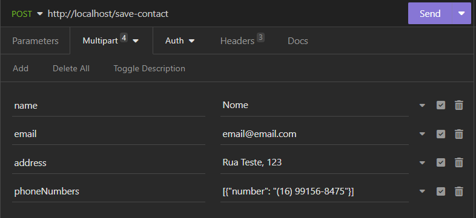
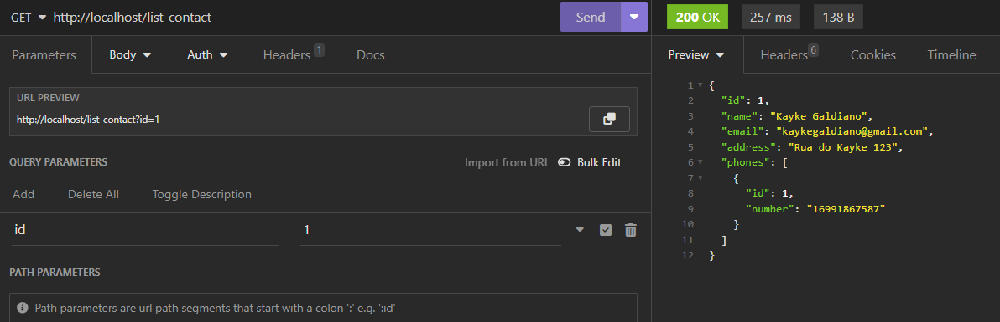

# Cohros Backend

## Requirements
- PHP 8.1+
- Composer
- SQLite extension enabled in php.ini

## Steps to install the project and its dependencies
- First, clone the project
- Run: ``composer install``
- Run: ``vendor/bin/captainhook configure`` to configure git hooks
- Run: ``vendor/bin/captainhook install`` to install captainhook

---

## Captainhook
You can configure the hooks you installed in the ``captainhook.json`` file

---

## PHPStan
There is a ``phpstan.neon`` file with some configs like the path to analyze and the level of the analyze.

---

## Steps to run the project
- Run the command ``php bin/doctrine orm:schema-tool:create`` to setup the database
- Run the command ``php fixtures.php`` to create a test user.
- Run ``php -S localhost:80 -t public`` to run the project on browser, you can choose any other port, in my case I choosed the port 80

---

## API routes
- ``/save-contact``

This POST endpoint creates (or update if you specify a query param id) a contact and receives a multipart form data with the following fields:
- name -> string
- email -> string
- address -> string
- phoneNumber -> json of a maximum of 4 objects

Example:

- ``/list-contact``

This GET endpoint lists all contacts created.

- ``/list-contact?id=id``

This GET endpoint lists an specific user with a query param id.

Example:

- ``/remove-contact?id=id``

This POST endpoint removes a contact with a query param id.

---
Have fun!
